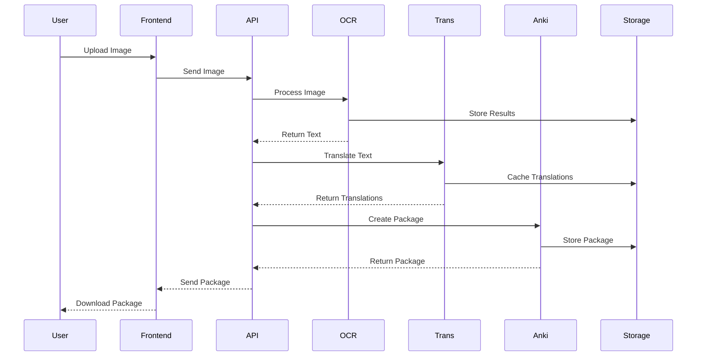
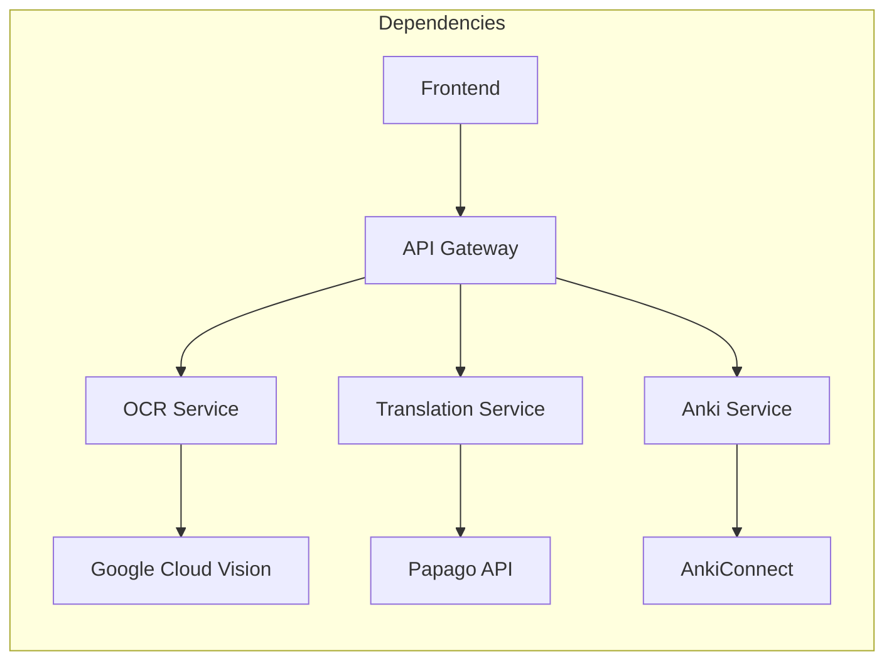
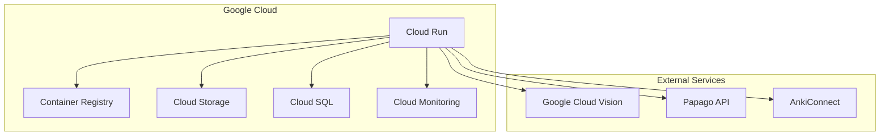
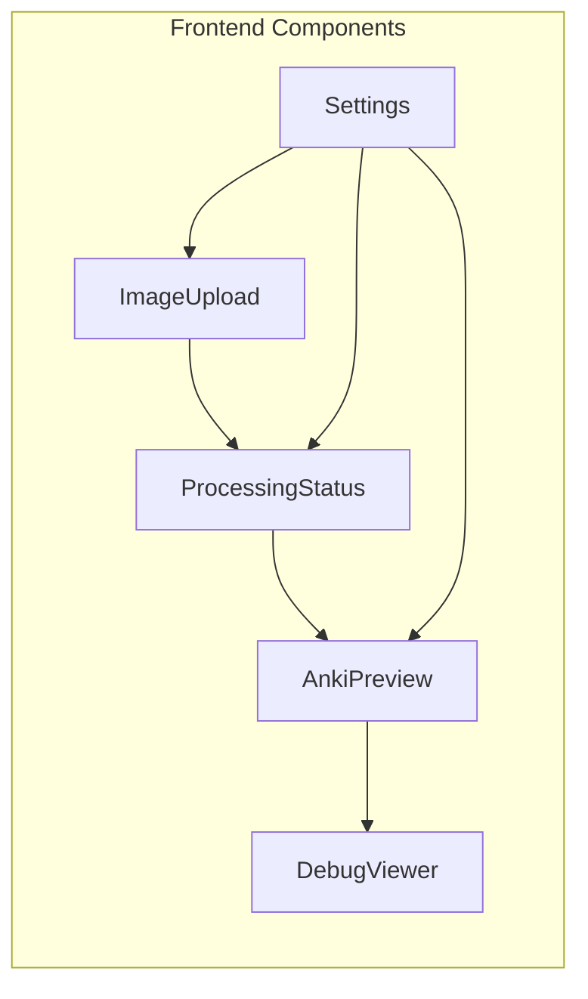
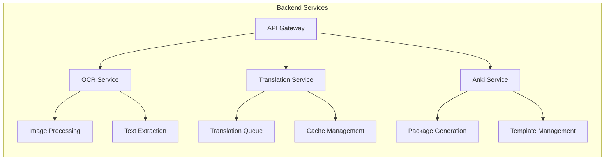
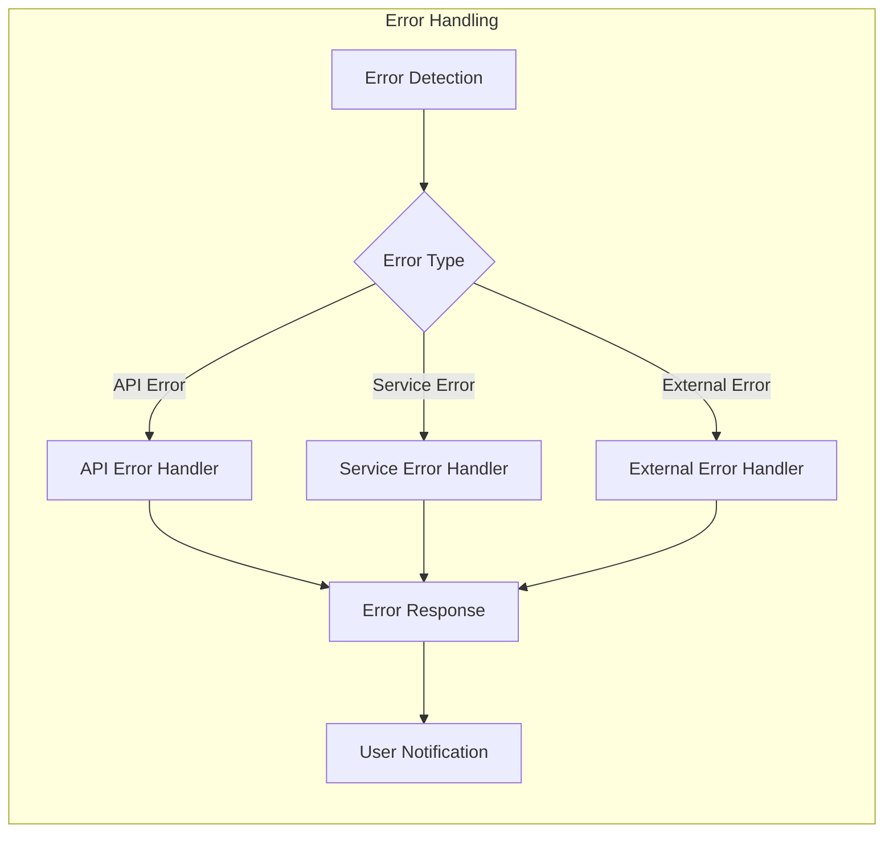
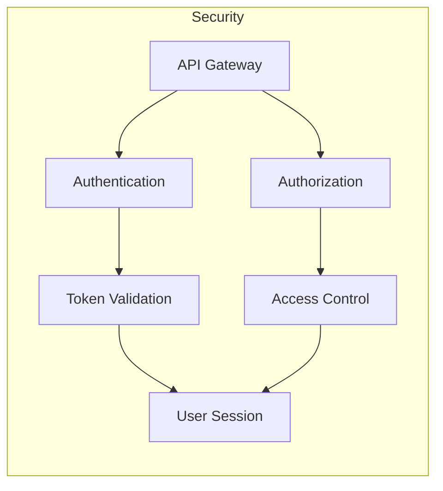

# System Architecture Diagram

## Overview
This document provides a visual representation of the Webtoon2Anki system architecture using Mermaid.js diagrams.

## System Components

```mermaid
graph TB
    subgraph Frontend
        UI[User Interface]
        State[State Management]
        Services[Frontend Services]
    end

    subgraph Backend
        API[API Gateway]
        
        subgraph Microservices
            OCR[OCR Service]
            Trans[Translation Service]
            Anki[Anki Package Service]
        end
        
        subgraph External Services
            GCV[Google Cloud Vision]
            Papago[Papago API]
            AnkiConnect[AnkiConnect]
        end
    end

    subgraph Storage
        Cache[Cache Service]
        DB[(Database)]
        Storage[Cloud Storage]
    end

    %% Frontend Connections
    UI --> State
    State --> Services
    Services --> API

    %% Backend Connections
    API --> OCR
    API --> Trans
    API --> Anki
    
    %% Microservice Connections
    OCR --> GCV
    Trans --> Papago
    Anki --> AnkiConnect
    
    %% Storage Connections
    OCR --> Cache
    Trans --> Cache
    Anki --> Storage
    API --> DB
```

## Data Flow



## Service Dependencies



## Deployment Architecture



## Component Details

### Frontend Components


### Backend Services


## Error Handling Flow



## Security Architecture

